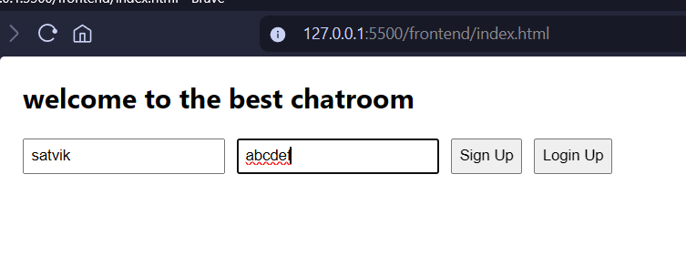
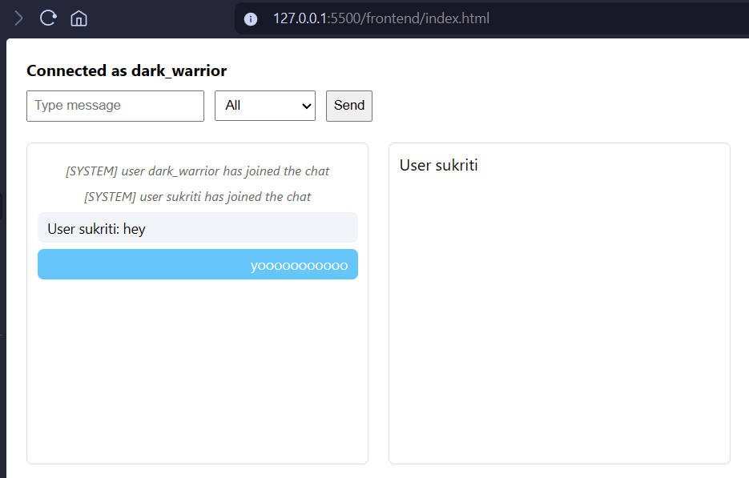
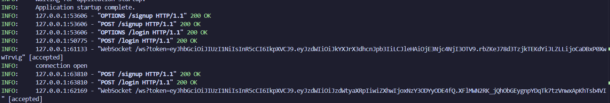
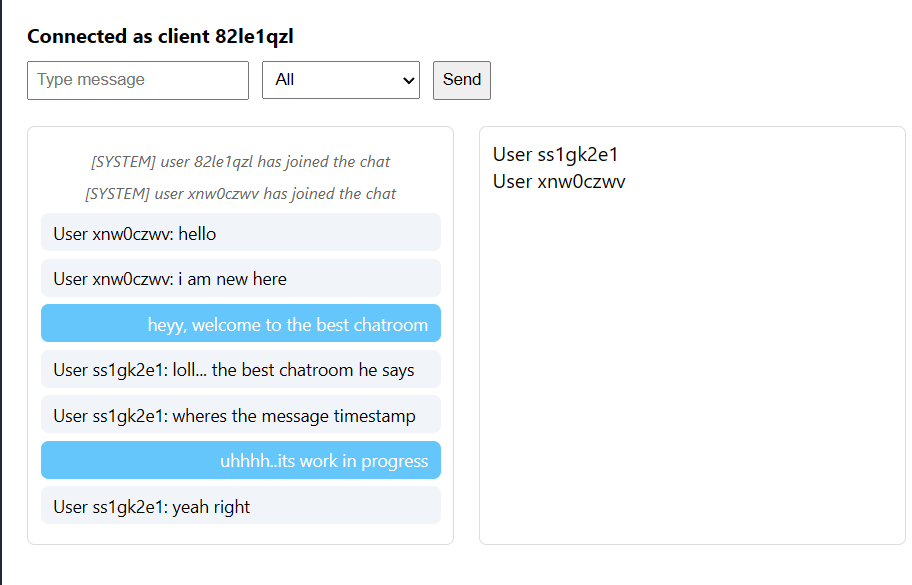

## v2.1.0
- completely refactored the frontend from legacy html-based approach to a modern React.js based application. way cleaner and maintainable now
- ditched the insecure query parameter approach for JWT token passing. now using http-only cookies only (security++). had to fight with samesite cookie policy for a while lol
- fixed a critical issue where cookies werent being sent with websocket upgrade requests. turns out you need `samesite="none"` and `secure=True` for cross-origin cookies, even on localhost
- added session persistence. users now stay logged in on page reload if their jwt token hasnt expired. backend verifies the token with a new `/verify` endpoint
- fixed react strict mode double-invoke issue that was spamming websocket connection errors. now checks if connection is already open before creating a new one
- added proper loading state while checking authentication on app startup
- also updated the cookie settings on logout endpoint to match the new samesite and secure attributes

## v2.0.0
- moved from in memory storage to database backed system (postgres op)
- message are persisted instead of just living on memory. when a user connects last 20 messages are fetched from the database
- refactored some of frontend code to reduce redudancy
- also fixed a bug where when a user breaks the connection from his side(reloading) the backend tries to disconnect him twice raising an error
- also moved a lot of steps like sending user list and loading chat history outside ConnectionManger.connect so the code is cleaner and a little easier to debug (i hope lol)
- added relevant model (both pydantic and sqlalchemy). the conversion between them took quite a bit of time and it was confusing man. i need to come up with a better approach

### demo 
 just visit : [deployed](https://chatroom-eight-xi.vercel.app/)

## v1.1.2
- there was a bug where the user_id was passed as the token.
- the user_id wasnt handled properly when reloading

## v1.1.1 
- there was a issue , where when the user reloads the webpage. it throws them back to auth page and will assign them a new jwt token on login again
- the old jwt token went to waste even if it was still valid and not expired
- i stored the jwt and userID to localStorage when the user logged in and if the page reloads we first check the localstorage if it contains a jwt token. if it is still valid we simply let the user enter enter the chatroom, otherwise back to the auth page they go
- also handeled deleting the jwt token from localStorage after the connection has beem cut

## v1.1.0
- client ids are no more randomized
- login and signup via jwt token authentication is implemented now.
- code refactored , seprated the jwt logic in seprate file. and moved all the pydantic models to model.py to make the codebase cleaner
- added .env to avoid leaking my secret key used for jwt.
- also added .env.example so anyone can make their .env 

### demo pics

#### login/signup

#### chatroom

#### logs and jwt token assigned

-------------------------------------------------------------------------------------------------------------------------------------------------------
## v1
- client_id is now a string, not int
- before the client was generating the client id and telling it to server which is a security issue, so now server makes the client_id and never trust the sender_id sent by clinet .... its purely for showing purpose. the server over writes it
- earlier each client got its own endpoint sometihng like this ws/{client_id} but thats not the case anymore . there is only /ws
- improved the UI a LITTLE BIT
- made the self message stable
- made Server messages distinguished

### demo pics

## v0
- right now, its pretty simple.
- frontend is just html cuz i am focusing on the websocket part rn
- when user enter, he is assigned a 3 digit intger called clinet_id . 
- each user gets a list of all the users online (excluding self) and backend sends updated list when someone new connects or disconnects
- users can type a message and select a reciepient from the dropdown . all (broadcast) or some specific user_id (dm type stuff)
- v(negative 1) was even trashier lol, it didnt have even option to dm or broadcast and the message was passed around in raw text . unlike now it is passed around as objects of a pydantic model .

"""
MESSAGE PROTOCOL (v0)

1. Broadcast message
{
  message_type: "broadcast",
  sender_id: string,
  reciever_id: null,
  message: string
}

2. Direct message (DM)
{
  message_type: "dm",
  sender_id: string,
  reciever_id: string,
  message: string
}

3. User list (system message)
{
  message_type: "user_list",
  sender_id: "server",
  reciever_id: null,
  message: JSON string of [user_id]
}

Rules:
- sender_id sent by client is ignored
- server overwrites sender_id
- client must not send user_list
"""

## WIP
- i am thinking of removing the clinet_id and introducing user_id, user_name and password alsong with signup and login. so people can actually know who are they texting to ....not some random number lol
